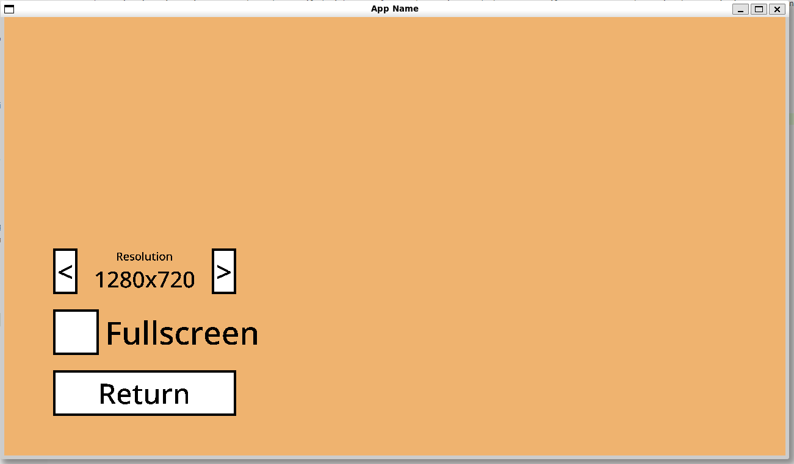
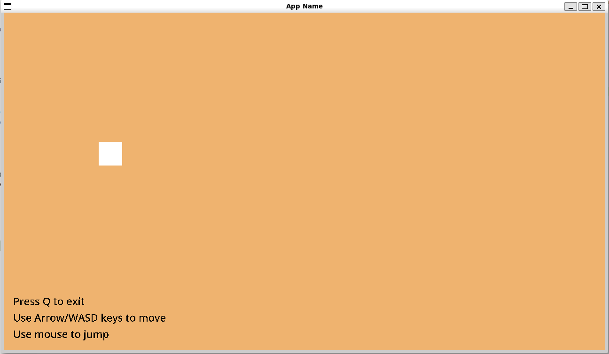
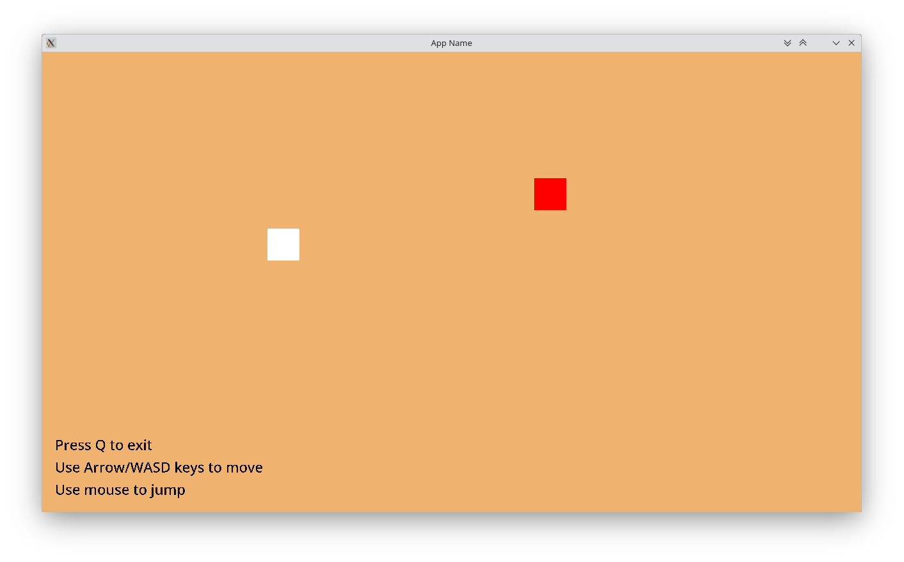

# Raw Wolf Engine

It's not full featured engine however it's basic library to create 2D game. The engine is abstraction for SDL2.

The engine is written in C++17 and can be compiled with GCC, Clang and Emscripten. (Other C++ compiler may support the engine however it is not guaranteed.)

## Features:
* Cross-platform: Windows 10+, Linux and Web
* Scenes support (Pre-created "Settings" and "Welcome" scene)
* Collision Box
* Mouse abstraction and Rescaling (like legacy Flash games)
* Image, Keyboard API support
* Simple Immediate-Gui (Button, Checkbox, Selector)
* Audio API over miniaudio
* Discord Activity Integration (Discord Game SDK is required)
* And some basic functions
* Multi User Support

## Will supported in future:
* Gamepad API (like Dualshock)
* Extended Graphics API
* Multi-Language Support
* Storage Mechanism for loading/saving game data

## Examples that developed with the engine:

> You can browse examples directory to learn how to use the engine.

### Basic

| | | |
|-|-|-|
||||

> ```clang++ -std=c++17 -Isrc -I. ./examples/basic.cpp -o basic.out -lSDL2 -lSDL2_ttf -lSDL2_image```

### Multi User



> ```clang++ -std=c++17 -Isrc -I. ./examples/multi_user.cpp -lcurl -o multi_user1.out -lSDL2 -lSDL2_ttf -lSDL2_image -DCLIENT_1 && ./multi_user1.out```

> ```clang++ -std=c++17 -Isrc -I. ./examples/multi_user.cpp -lcurl -o multi_user2.out -lSDL2 -lSDL2_ttf -lSDL2_image -DCLIENT_2 && ./multi_user2.out```

### Real World Examples:

* [Flying Doge](https://malisipi.itch.io/flying-doge) - Not open-sourced yet

# License

The library is licensed by [MPL 2.0 License](./LICENSE).

## Dependencies:

* [Miniaudio](https://github.com/mackron/miniaudio) (Located on `./thirdparty/miniaudio.h`) - Licensed by [Public Domain](https://github.com/mackron/miniaudio/blob/master/LICENSE)
* [Crow](https://github.com/CrowCpp/Crow) (Located on `./thirdparty/crow_all.h`) - Licensed by [BSD 3-Clause License](https://github.com/CrowCpp/Crow/blob/master/LICENSE)
* [Noto Sans](https://fonts.google.com/noto/specimen/Noto+Sans) (Located on `./examples/assets/fonts/NotoSans-Medium.ttf`) - Licensed by [Open Font License](https://fonts.google.com/noto/specimen/Noto+Sans/about)

## Optional Dependencies:
* [Discord Game SDK](https://discord.com/developers/docs/game-sdk/discord) (not included)
